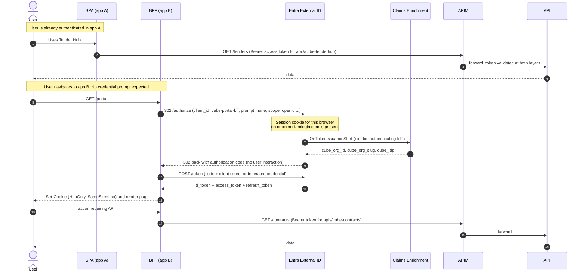
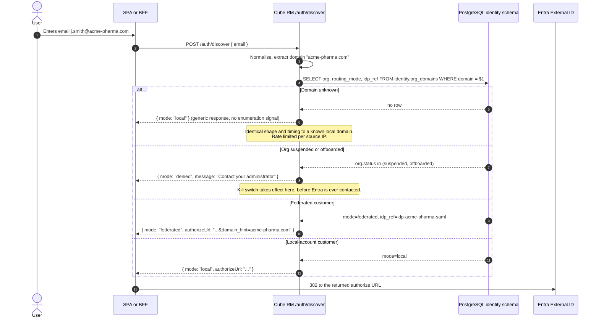
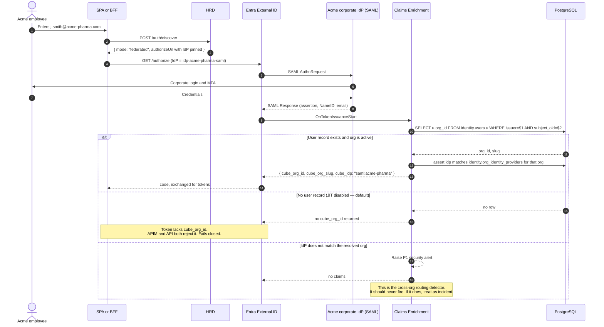
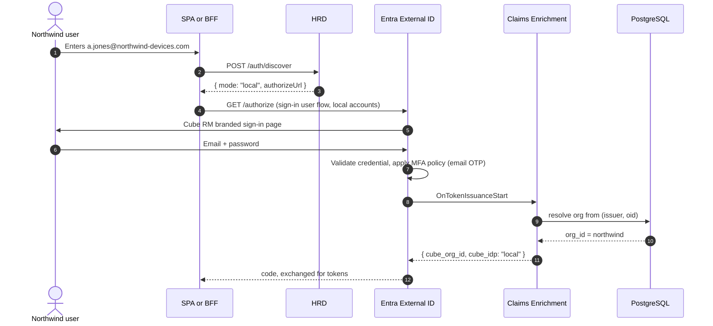
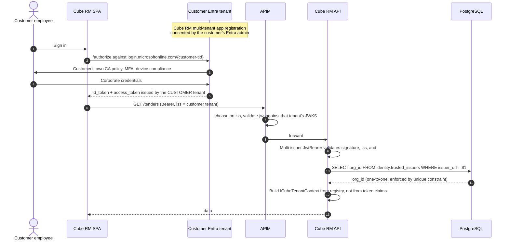
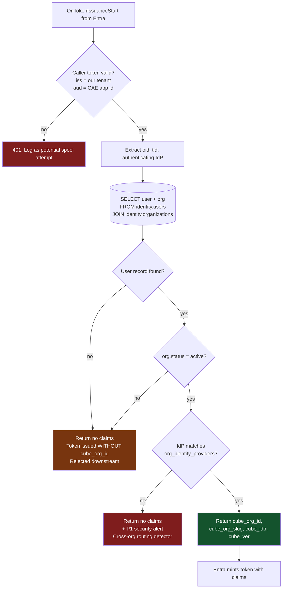

# 2. Authentication Flows

All diagrams are Mermaid and render in GitHub, Azure DevOps wiki and VS Code.

Participants used throughout:

| Short | Full |
| --- | --- |
| `SPA` | React/Angular SPA using MSAL.js (`cube-tenderhub-spa`) |
| `BFF` | Server-rendered .NET app acting as backend-for-frontend (`cube-portal-bff`) |
| `HRD` | Cube RM home-realm-discovery service, `/auth/discover` |
| `CIAM` | Entra External ID external tenant, `cuberm.ciamlogin.com` |
| `CAE` | Cube RM claims-enrichment endpoint (`OnTokenIssuanceStart` handler) |
| `APIM` | Azure API Management |
| `API` | A Cube RM .NET 8 API |
| `PG` | PostgreSQL `identity` schema |
| `CIdP` | Customer's corporate IdP (SAML or OIDC) |

---

## 2.1 Flow (a) — Internal user SSO across Cube RM applications

A user already signed in to the Tender Hub SPA opens the Portal (BFF) and is not
re-prompted. The shared artifact is the **External ID session cookie** on
`cuberm.ciamlogin.com`, which both applications' authorize requests hit.

### Why this works, and where it is fragile

| Aspect | Note |
| --- | --- |
| **Shared SSO domain** | All apps use the same `ciamlogin.com` authority. SSO is a property of that shared session cookie, not of anything we build. |
| **Separate app registrations** | One per Cube RM application, each with its own `aud`. A token for `api://cube-tenderhub` is rejected by the contracts API. This is intra-Cube-RM blast radius containment. |
| **BFF holds tokens server-side** | Browser gets only an HttpOnly cookie. No token in `localStorage`. This is the posture we quote in customer security reviews. |
| **⚠ SPA silent SSO is the fragile path** | MSAL.js `ssoSilent` uses a hidden iframe against the authorize endpoint. That is a **third-party cookie** in every modern browser's default configuration, and it is increasingly blocked. |

**Recommendation for the mixed topology:** do not rely on hidden-iframe `ssoSilent` for
cross-app SSO. Use one of:

1. **Full-page redirect with `prompt=none`** — visually a flash, but uses a first-party
   cookie and is not affected by third-party cookie policy. Acceptable default.
2. **Move SPAs behind a BFF** (the recommended long-term shape). The SPA keeps its
   client-side rendering; token handling moves server-side. This also unifies the session
   model across both app styles, which matters for the offboarding story in
   [§6](06-offboarding-incident.md) — you can kill a server-side session immediately, but
   you cannot recall a token already in a browser.

Option 2 is what we should converge on. Option 1 is the migration-safe interim.

---

## 2.2 Flow (d) — Email-domain routing (the entry point for both b and c)

This is shown before (b) and (c) because it is what selects between them. **We own this
step**; it is not delegated to External ID's native routing.

### Design notes

- **Unknown domain returns `local`, not an error.** Returning "no such organisation" is a
  user-enumeration oracle that tells an attacker which pharma companies are Cube RM
  customers — commercially sensitive independent of the security concern. The response
  shape, size and timing are identical for known-local and unknown domains.
- **The suspended branch is the kill switch.** It is evaluated from PostgreSQL on every
  discovery call, so revoking a customer's access takes effect on the next sign-in
  attempt with no Entra change required. Combined with the edge deny-list
  ([§4.4](04-apim-configuration.md)) for tokens already issued, this gives
  seconds-to-effect offboarding.
- **`idp_ref` pins exactly one IdP.** The user is never shown a list of identity providers
  (see [§1.5.2](01-tenant-isolation-model.md)).
- **Rate limited and monitored.** `/auth/discover` is an unauthenticated endpoint that
  reads the org registry. It gets aggressive per-IP rate limiting at APIM and an alert on
  high-cardinality domain probing.
- **⚠ Spike dependency.** Whether `domain_hint` reliably suppresses the IdP picker in an
  external tenant is risk register **R3**. If it does not, the fallback is a dedicated
  per-org authorize path using the IdP-specific parameter that testing shows does work.
  The HRD contract does not change either way — this is exactly why we own this layer.

---

## 2.3 Flow (b) — Enterprise customer federated SSO

Acme Pharmaceuticals federates their corporate SAML IdP. Their staff use corporate
credentials and never hold a Cube RM password.

**The critical property:** `cube_org_id` is resolved from the **pre-existing user record**,
not from which IdP performed the authentication. An unexpected or manipulated IdP path
therefore produces a token with no org claim — useless — rather than a token scoped to the
wrong organisation.

---

## 2.4 Flow (c) — Local email + password customer

Northwind Medical Devices declines SSO. Their users get accounts in our tenant.

### Local-account specifics

| Concern | Approach |
| --- | --- |
| **Account creation** | Invitation-only. Self-service sign-up is **disabled** — in a shared tenant, open sign-up lets anyone create an account with an unverified domain. Org admins invite via the Tenant Admin API. |
| **Password policy** | Tenant-wide (one tenant, one policy). Set to the strictest any customer requires. Per-org password policy is **not available** — flag this in contracts. |
| **MFA** | Email OTP as baseline. Stronger factors require the P1/P2 add-on, which is **per-MAU** — see [MAU model](08-mau-cost-model.md). |
| **Password reset** | Self-service via the user flow. Rate limited. |
| **Coexistence with (b)** | Both flows are the same user flow and the same app registration. Only the pinned IdP differs. No per-customer app registration. |

The password-policy constraint is worth surfacing early in customer conversations: a
single tenant means a single password policy, so the most security-conscious customer
effectively sets it for everyone. That is usually acceptable (strictest wins is a safe
direction) but it is a commitment, not a default.

---

## 2.5 Flow (e) — Entra-to-Entra fallback: customer tenant as a trusted issuer

Used when a customer runs their own Entra workforce tenant and built-in federation is
blocked or unreliable. See [ADR-0004](adr/0004-multi-issuer-fallback.md) and risk
register **R1**.

### Trade-offs, stated plainly

| Gain | Cost |
| --- | --- |
| Bypasses External ID federation entirely — no dependency on the uncertain path | Tokens are **not** issued by our tenant, so `OnTokenIssuanceStart` never fires. No `cube_org_id` claim. |
| Customer's own CA, MFA and device compliance apply natively — a strong story for security-conscious pharma | Org is resolved server-side from `identity.trusted_issuers`, adding a lookup (cached) to the request path |
| No MAU cost — these users never authenticate against our external tenant | SSO with our *other* apps is not shared through the CIAM session cookie; each app authenticates against the customer tenant separately |
| Customer revokes access instantly by removing our app's consent | We must monitor their tenant's continued consent, and handle the `aud`/`scp` model differing from our CIAM tokens |

The MAU line is significant enough to call out: **this path materially reduces MAU cost**
for large federated customers, which may make it attractive beyond its role as a fallback.
That should be modelled before Phase 2 — see [MAU model §8.5](08-mau-cost-model.md).

---

## 2.6 Flow (f) — Claims enrichment internals

The `OnTokenIssuanceStart` handler is on the critical authentication path. Its failure
behaviour is a design decision, not an accident.

### Availability coupling — the honest version

This endpoint being down means **no user of any customer can obtain a usable token**. That
is a self-inflicted single point of failure and it must be treated as such:

| Control | Requirement |
| --- | --- |
| Latency budget | p99 under 500 ms. Entra's timeout for the extension is short; exceeding it fails issuance. Validate the exact budget in spike **R2**. |
| Hosting | Multi-instance Container Apps or App Service with zone redundancy. Not the same deployment unit as product APIs. |
| Data access | Read-only replica or in-process cache of `(issuer, oid) → org` with short TTL. The lookup must not depend on the primary write database. |
| Deployment | Separate release cadence from product code. Changes here are identity-critical. |
| Degraded mode | If we cannot meet the SLO, fall back to directory extension attributes (`cubeOrgId`) as the claim source, which removes the runtime dependency at the cost of the fail-closed-on-suspension property. Decision gated on **R2**. |
| Monitoring | Synthetic sign-in canary per org archetype, every 5 minutes, alerting within one interval. |

The degraded mode is the important escape hatch. If R2 shows the latency or availability
envelope is not achievable, we move the org binding to directory attributes and accept
that suspension propagates via a Graph write rather than instantly — still acceptable,
because the edge deny-list ([§4.4](04-apim-configuration.md)) remains the fast path for
revocation.
