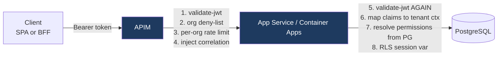

# 4. APIM Configuration

Where token validation happens, what the gateway enforces, and how tenant isolation is
expressed at the edge.

Policy files live in [`infra/apim/policies`](../../infra/apim/policies).

---

## 4.1 Division of responsibility



**APIM is a coarse, fast gate. It is not the authorization decision.**

| Check | Gateway | In-app | Why there |
| --- | --- | --- | --- |
| Signature / `iss` / `aud` / `exp` | ✅ | ✅ | Cheap reject at edge; independent verification in app so a gateway bypass is not sufficient |
| `cube_org_id` claim present | ✅ | ✅ | Rejects malformed-token classes before they consume app capacity |
| Org suspended | ✅ | ✅ | Gateway gives seconds-to-effect revocation; app is authoritative |
| Per-org rate limit | ✅ | ❌ | Needs a shared view across instances — that is the gateway's job |
| Request size / schema | ✅ | ✅ | Edge shields the app from obvious abuse |
| User permissions | ❌ | ✅ | Requires database state; putting it at the edge would couple APIM to PostgreSQL |
| Row-level tenant scope | ❌ | ✅ (+ RLS) | Data-layer concern |

The consistent principle: **the gateway can only ever reject more, never permit more.**
Nothing the gateway does is trusted by the application as a grant.

---

## 4.2 Base inbound policy

See [`infra/apim/policies/global-inbound.xml`](../../infra/apim/policies/global-inbound.xml).

```xml
<validate-jwt header-name="Authorization"
              failed-validation-httpcode="401"
              failed-validation-error-message="Unauthorized"
              require-expiration-time="true"
              require-signed-tokens="true"
              clock-skew="30">
  <openid-config url="https://cuberm.ciamlogin.com/{{cube-tenant-id}}/v2.0/.well-known/openid-configuration" />
  <audiences>
    <audience>{{api-audience}}</audience>
  </audiences>
  <required-claims>
    <claim name="cube_org_id" match="any" />
  </required-claims>
</validate-jwt>
```

Notes:

- **`clock-skew="30"`** — matching the in-app setting. The APIM default is more generous
  and would silently extend token lifetime past what the offboarding SLA assumes.
- **`required-claims` with no `<value>` asserts presence only.** This is the cheap
  structural check that rejects any token issued without org enrichment — including the
  fail-closed tokens from [flow (f)](02-auth-flows.md#26-flow-f--claims-enrichment-internals).
- **`failed-validation-error-message` is deliberately generic.** Detailed validation errors
  at the edge are a reconnaissance aid.

---

## 4.3 Multi-issuer validation at the gateway

`validate-jwt` takes one `openid-config`. Supporting the
[trusted-issuer path](02-auth-flows.md#25-flow-e--entra-to-entra-fallback-customer-tenant-as-a-trusted-issuer)
requires branching on the issuer *before* validation, then fully validating in each branch.

See [`infra/apim/policies/fragments/multi-issuer-validate.xml`](../../infra/apim/policies/fragments/multi-issuer-validate.xml).

```xml
<choose>
  <when condition='@((string)context.Variables["unvalidatedIssuer"] == "{{cube-ciam-issuer}}")'>
    <validate-jwt ... output-token-variable-name="validatedToken">
      <openid-config url="{{cube-ciam-openid-config}}" />
      <required-claims><claim name="cube_org_id" match="any" /></required-claims>
    </validate-jwt>
  </when>
  <when condition='@(((string[])context.Variables.GetValueOrDefault("trustedIssuers", new string[0]))
                     .Contains((string)context.Variables["unvalidatedIssuer"]))'>
    <!-- Customer workforce tenant. No cube_org_id claim — org resolved in-app from registry. -->
    <validate-jwt ...>
      <openid-config url='@((string)context.Variables["issuerOpenIdConfigUrl"])' />
    </validate-jwt>
  </when>
  <otherwise>
    <return-response><set-status code="401" /></return-response>
  </otherwise>
</choose>
```

> **XML mechanics.** Policy expressions routinely contain `"` and `<`, neither of which is
> legal inside a double-quoted XML attribute value. Use single-quote delimiters for
> attributes containing double quotes, and CDATA for anything containing generics. The
> shipped policies in `infra/apim/policies` are validated as well-formed XML in CI — a
> malformed policy is otherwise only discovered at deploy time.

**The security-critical subtlety:** reading `iss` from an *unvalidated* token to select a
validator is safe **only because every branch then fully validates against that issuer's
own JWKS, and the issuer must already be in our allowlist.** An attacker who forges
`iss` merely selects which validator rejects them. This reasoning must be written in a
comment in the policy file, because the pattern looks alarming to a reviewer who does not
have it. It is in the shipped fragment.

Note the asymmetry: customer-tenant tokens carry **no `cube_org_id`**, so the gateway
cannot enforce the org deny-list for them. Revocation on that path is
consent-removal plus the in-app registry check — covered in
[§6](06-offboarding-incident.md).

---

## 4.4 The org deny-list — fast revocation

The problem: access tokens live 60–90 minutes. Disabling a customer in Entra stops *new*
tokens; it does nothing about tokens already in browsers and BFF caches.

The gateway closes that window.

```xml
<cache-lookup-value key="cube-suspended-orgs" variable-name="suspendedOrgs" caching-type="internal" />
<choose>
  <when condition='@(!context.Variables.ContainsKey("suspendedOrgs"))'>
    <send-request mode="new" response-variable-name="denyResp" timeout="5" ignore-error="false">
      <set-url>{{identity-service-base}}/internal/suspended-orgs</set-url>
      <authentication-managed-identity resource="{{identity-service-resource}}" />
    </send-request>
    <!-- CDATA, because the generic angle brackets are not legal in an attribute value. -->
    <set-variable name="suspendedOrgs">
      <![CDATA[@{
        var body = ((IResponse)context.Variables["denyResp"]).Body.As<JArray>();
        return body.Select(t => t.ToString()).ToArray();
      }]]>
    </set-variable>
    <cache-store-value key="cube-suspended-orgs"
                       value='@(context.Variables["suspendedOrgs"])' duration="30" />
  </when>
</choose>
<choose>
  <when condition='@(((string[])context.Variables["suspendedOrgs"]).Contains((string)context.Variables["orgId"]))'>
    <return-response>
      <set-status code="403" reason="Forbidden" />
      <set-body>{"error":"organization_suspended"}</set-body>
    </return-response>
  </when>
</choose>
```

| Property | Value |
| --- | --- |
| Time to effect | ≤ 30 s (cache TTL), independent of token lifetime |
| Failure mode | `ignore-error="false"` — if the identity service is unreachable and cache is cold, requests fail. **Fail closed.** |
| Cost | One internal call per gateway node per 30 s |

**The fail-closed choice deserves scrutiny.** A cold cache plus an identity-service outage
means a platform-wide 403. The mitigations are: a 30-second TTL against a tiny, highly
available read endpoint; a stale-while-revalidate window of up to 5 minutes so a transient
blip serves the last known list; and hard-failing only if the cache is genuinely empty
(cold start during an outage). That residual case is accepted deliberately — briefly
failing closed is the correct trade for a revocation control that a customer's security
team is relying on.

---

## 4.5 Per-organisation rate limiting

Noisy-neighbour protection is a genuine isolation property in a shared platform, and one
that shows up in enterprise contracts as an availability commitment.

```xml
<!-- Single-quote delimiters: the expression contains double quotes, which are not
     legal inside a double-quoted XML attribute value. -->
<rate-limit-by-key calls="600" renewal-period="60"
                   counter-key='@((string)context.Variables["orgId"])'
                   increment-condition="@(context.Response.StatusCode != 429)" />
<quota-by-key calls="500000" renewal-period="86400"
              counter-key='@((string)context.Variables["orgId"])' />
```

Limits come from the org's tier, stored as an APIM named value refreshed by the
provisioning reconciler, so a customer's contracted tier is expressed in the same
declarative artifact as the rest of their configuration (see [§5](05-onboarding-runbook.md)).

---

## 4.6 Correlation headers

APIM injects, **for logging and routing only**:

| Header | Purpose |
| --- | --- |
| `X-Cube-Org-Id` | Log correlation, backend routing |
| `X-Cube-Correlation-Id` | Trace across APIM → App Service → Service Bus → Durable Functions |
| `X-Cube-Gateway-Validated` | Signals the edge validated; **never** accepted as proof |

And **strips** any inbound `X-Cube-*` header before adding its own — otherwise a client can
inject `X-Cube-Org-Id` and, if any code anywhere ever trusts it, cross tenants. The strip
is unconditional and comes first:

```xml
<set-header name="X-Cube-Org-Id" exists-action="delete" />
<set-header name="X-Cube-Gateway-Validated" exists-action="delete" />
<!-- ...then set from validated claims -->
```

As stated in [§3.4](03-dotnet-integration.md), the API compares `X-Cube-Org-Id` against the
org it derived from the token itself and alerts on mismatch. The header is a tripwire, not
an input.

---

## 4.7 Network posture — making the gateway non-bypassable

APIM enforcement is theatre if the App Service is reachable directly. Required:

1. **Private endpoints** on App Service / Container Apps; APIM in the same VNet (Standard v2
   or Premium for VNet injection).
2. **Public network access disabled** on backends.
3. Where private networking is not yet in place, `ip-restriction` allowlisting only the
   APIM subnet — an interim, not the target state.
4. Backend authentication via **managed identity** from APIM, so the backend can assert the
   call came from the gateway independent of network position.

Independent in-app token validation ([§3.4](03-dotnet-integration.md)) means none of these
are load-bearing for the isolation guarantee. They are defence in depth and they are what a
pharma security questionnaire will ask about by name.

---

## 4.8 What we are *not* doing at the gateway

| Rejected | Why |
| --- | --- |
| Token exchange / on-behalf-of at APIM | Puts credential handling in policy expressions, which are hard to test and review. Belongs in the BFF. |
| Per-customer APIM products or subscriptions | 30 products to manage, and it leaks customer identity into gateway topology. Isolation is claim-driven, not product-driven. |
| Caching authorization decisions at the edge | Permission revocation must be prompt. Edge caching of *authz* would undo that. Caching the *suspension list* is different — it is a deny-list, so staleness only ever over-permits for ≤30 s, which is bounded and accepted. |
| Resolving roles at the gateway | Couples APIM to PostgreSQL and duplicates the authorization model in policy XML. |
