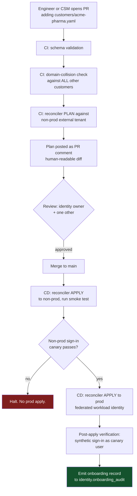
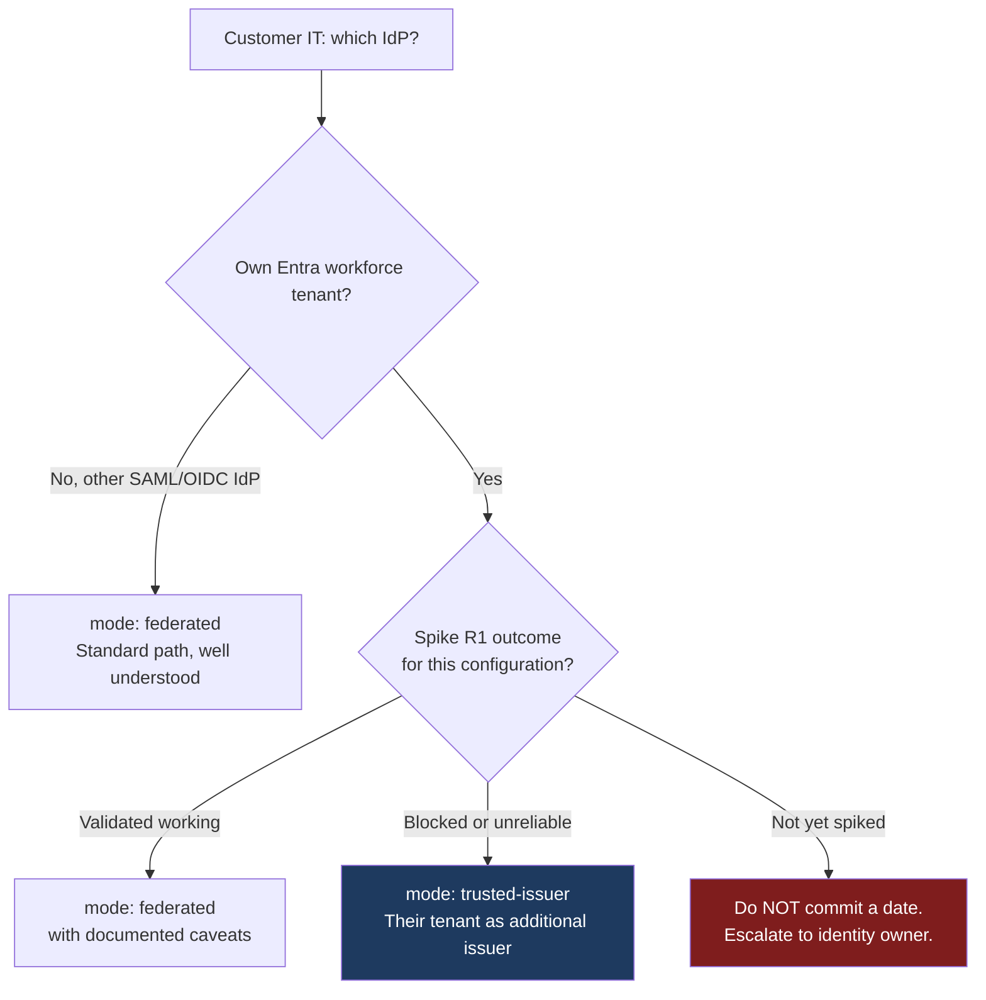

# 5. Customer Onboarding — Runbook and Automation

How customer #21 gets added without a portal session, and why that matters more at 30
customers than it does at 5.

---

## 5.1 The principle

> **A customer's identity configuration is a reviewed file in git. A machine applies it.
> No human touches the production Entra tenant.**

This is not tidiness. In a single shared tenant, a manual portal change is a change made
directly against the environment serving all 30 customers, with no diff, no review, no
rollback and no record beyond the audit log. The declarative pipeline exists to make
[RT-1 and RT-7](01-tenant-isolation-model.md#19-residual-risks-of-the-single-tenant-model)
— the two risks the single-tenant decision actually creates — structurally unlikely.

## 5.2 The artifact

One file per customer in [`infra/customers/`](../../infra/customers), validated against
[`customer.schema.json`](../../infra/customers/_schema/customer.schema.json).

```yaml
# infra/customers/acme-pharma.yaml
apiVersion: identity.cuberm.com/v1
kind: CustomerOrganization
metadata:
  slug: acme-pharma                     # immutable
  displayName: Acme Pharmaceuticals GmbH
spec:
  status: active                        # active | suspended | offboarding | offboarded
  tier: enterprise
  domains:
    - domain: acme-pharma.com
      verified: true
      verificationRef: DNS-TXT-2026-02-11
    - domain: acme-pharma.co.uk
      verified: true
      verificationRef: DNS-TXT-2026-02-11
  authentication:
    mode: federated                     # federated | local | trusted-issuer
    federation:
      protocol: saml
      displayName: Acme Corporate SSO
      metadataUrl: https://sso.acme-pharma.com/federationmetadata.xml
      claimsMapping:
        email: http://schemas.xmlsoap.org/ws/2005/05/identity/claims/emailaddress
        givenName: .../claims/givenname
        surname: .../claims/surname
      jitProvisioning:
        enabled: true
        requireVerifiedDomain: true     # cannot be false — schema-enforced
  rateLimits:
    callsPerMinute: 600
    callsPerDay: 500000
  contacts:
    securityContact: security@acme-pharma.com
    technicalContact: it-sso@acme-pharma.com
```

A local-account customer is the same file with a smaller `authentication` block:

```yaml
  authentication:
    mode: local
    local:
      selfServiceSignUp: false          # schema-enforced false. Invitation only.
      initialAdmins:
        - email: admin@northwind-devices.com
```

### Why YAML in git rather than Terraform

The `azuread` Terraform provider's coverage of External ID **external tenant** identity
providers and user flows is thin and lags the product. Betting the onboarding path on
provider coverage would put us one unsupported resource away from falling back to manual
portal work — the exact outcome this design exists to prevent.

Instead: a purpose-built .NET reconciler using the Microsoft Graph SDK. It fits the
existing .NET investment, runs in the existing CI, and we control its resource coverage.
Azure *infrastructure* (APIM, App Service, networking) stays in Bicep/Terraform as today —
this replaces neither.

## 5.3 The pipeline



Three gates are non-negotiable:

1. **Domain-collision check.** Two customers claiming the same email domain is the
   single most dangerous onboarding error available — it silently routes one customer's
   users to another's IdP. CI fails the PR, before any human judgement is involved.
2. **Plan before apply, always.** The reconciler never applies without a reviewed plan, and
   a plan containing *deletions* requires an explicit `--confirm-destructive` flag that CI
   only supplies for an offboarding-labelled PR.
3. **Non-prod first.** Every change lands in the non-prod external tenant and passes a
   synthetic sign-in before prod. This is what catches "the metadata URL is wrong" before
   it is a production incident for a named customer.

## 5.4 The reconciler

[`src/CubeRM.Identity.Provisioning`](../../src/CubeRM.Identity.Provisioning) — a .NET 8
console app with `plan` / `apply` semantics.

```
cube-identity plan  --customer acme-pharma --tenant non-prod
cube-identity apply --customer acme-pharma --tenant prod --confirm
cube-identity drift --tenant prod           # reconcile-all, report divergence, no writes
```

### Reconciliation targets

| Resource | Graph surface | Idempotency key |
| --- | --- | --- |
| Org record in PostgreSQL | our own API | `slug` |
| Domain routing rows | our own API | `domain` |
| Identity provider (SAML/OIDC) | `identityProviders` | `displayName = idp-{slug}-{proto}` |
| Operational groups | `groups` | `mailNickname = org.{slug}.members` |
| User-flow ↔ IdP association | user flow config | `(userFlowId, idpId)` |
| Directory extension attribute values | `users` | `(issuer, oid)` |
| APIM rate-limit named values | ARM | `cube-ratelimit-{slug}` |
| Trusted issuer (mode `trusted-issuer`) | our own API | `issuer_url` |

Everything is **upsert by natural key**, so a re-run is a no-op and a partial failure is
resumable. There is no "create" path that fails on second run — a reconciler that cannot
be safely re-run is a reconciler people avoid running.

### Required Graph permissions (application, minimised)

| Permission | Why | Notes |
| --- | --- | --- |
| `IdentityProvider.ReadWrite.All` | Create/update customer IdPs | Tenant-wide. **No narrower scope exists** — a genuine residual risk (RT-7) |
| `User.ReadWrite.All` | Provision users, write extension attributes | |
| `Group.ReadWrite.All` | Operational groups | |
| `Application.Read.All` | Read app registrations for user-flow association | Read, not write |
| `AuditLog.Read.All` | Post-apply verification | |

The service principal authenticates with a **federated credential from the CI workload
identity** — no client secret exists to leak or rotate. It is usable only from a pipeline
run on a protected branch. Its permissions are tenant-wide because Graph offers no
per-customer scoping for IdP management; that is stated plainly as RT-7 rather than
papered over.

## 5.5 The human runbook

What a person actually does for customer #21. Target: **under 30 minutes of Cube RM
effort**, most of it waiting on the customer.

### Phase A — Intake (CSM / Solutions)

1. Confirm the authentication mode with the customer's IT:
   - Corporate IdP (SAML/OIDC) → `federated`
   - Own Entra tenant, wants direct trust → `trusted-issuer` (see §5.6 — **do not promise
     `federated` to an Entra customer before the spike lands**)
   - No SSO → `local`
2. Collect email domains. **All** of them, including acquisitions and country subsidiaries —
   a missed domain is a support ticket on day one.
3. Send the customer the federation pack (metadata URL / entity ID / ACS URL, claims
   mapping requirements, our SP metadata).

### Phase B — Domain verification (required, no exceptions)

4. Issue a DNS TXT challenge per domain: `cube-verify=<nonce>`.
5. Automated verification job confirms and records `verificationRef`.

> Federation is never enabled for an unverified domain. Without this, customer B can claim
> customer A's domain and receive their users' sign-ins. This is the control that makes the
> domain-routing model safe in a shared tenant.

### Phase C — Declare and apply

6. Open a PR adding `infra/customers/{slug}.yaml`.
7. CI runs schema validation, collision check and plan. Review the plan.
8. Merge → non-prod apply → smoke → prod apply.

### Phase D — Verify (Cube RM, before handing over)

9. Create a **canary user** in the customer's org and complete a real sign-in end to end.
10. Assert the issued token carries the correct `cube_org_id` and `cube_idp`.
11. Run the **cross-tenant probe**: authenticate as the canary and confirm a request for a
    known other-org resource returns 404/403 and that RLS returned zero rows.
12. Confirm the per-org synthetic canary is registered in monitoring.

Step 11 is the one people skip. It is the only step that actually tests the promise we
made to the customer, and it should be evidence attached to the onboarding record.

### Phase E — Handover

13. Customer's first org admin is invited via the Tenant Admin API.
14. Onboarding record written to `identity.onboarding_audit` with the PR link, plan hash,
    verification refs and canary evidence.

## 5.6 The Entra-customer decision gate

Large pharma and medical device organisations are disproportionately on Microsoft Entra.
This is not an edge case; it is likely to be the *majority* archetype.



**Do not let a sales commitment precede the R1 spike outcome.** The failure mode is
committing to a federation date for a customer whose configuration turns out to be one of
the blocked ones, and then discovering it during their security review. The
`trusted-issuer` fallback is good — genuinely good, and cheaper on MAU — but it is a
different integration conversation with the customer's IT, and that conversation needs to
happen before contract, not after.

## 5.7 Scaling past 30

The design holds to a few hundred customers without change. The points that bend first:

| Limit | Where it bites | Mitigation |
| --- | --- | --- |
| IdP objects per tenant | Entra service limits on `identityProviders` | Confirm the exact limit during R1. Above it, `trusted-issuer` mode has no such limit. |
| Reconciler runtime | Full drift scan over N customers | Per-customer reconcile in CI; nightly full drift scan runs in parallel |
| Domain table lookups | `/auth/discover` hot path | Already an indexed single-row lookup with in-process cache |
| Onboarding review load | Two reviewers per PR | Template-driven PRs; auto-approve for `local` mode with no new domains |
| Tenant-wide password policy | One policy for all | Contractual, not technical — set expectations at sales |

The genuinely non-scaling item is the **single tenant-wide password and MFA policy**. It
does not get worse with volume, but it does get harder to change as more customers have
contractual expectations built on it. Set it strict at the start.
