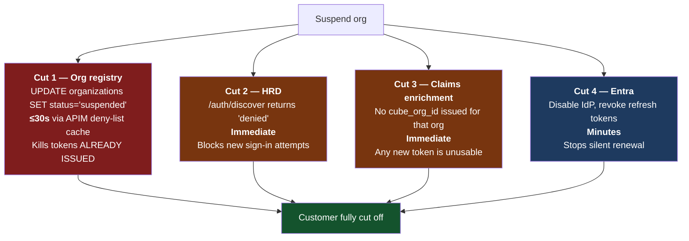
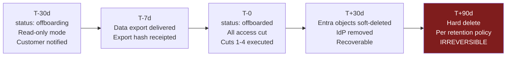

# 6. Offboarding and Incident Response

Cutting off one customer, completely, with zero impact on the other 29 — in a tenant they
all share.

---

## 6.1 The three scenarios

| Scenario | Trigger | Time to effect | Reversible |
| --- | --- | --- | --- |
| **A — Emergency suspension** | Suspected compromise of the customer's IdP or a Cube RM incident | **≤ 30 seconds** | Yes, immediately |
| **B — Contractual offboarding** | Contract ends | Scheduled, staged over 30–90 days | Yes, until purge |
| **C — Federation-only cutover** | Customer changes IdP or drops SSO | Planned maintenance window | Yes |

Scenario A is the one that has to be right, because it will be executed under pressure by
someone who is not the person who designed it.

---

## 6.2 The kill chain — why this is fast

The thing that makes revocation slow in most designs is **token lifetime**: disabling
accounts in the directory stops new tokens but does nothing about the 60–90 minutes of
already-issued access tokens sitting in browsers and BFF caches. Our design has four
independent cut points, and the fast ones do not involve Entra at all.



**Cuts 1–3 are single-row updates in our own PostgreSQL.** They require no Entra access, no
portal session, no elevated directory role, and — critically — **they cannot affect another
customer**, because they are `WHERE org_id = $1`. That property is what makes this safe to
execute at 3am.

Cut 4 is the only step that touches shared infrastructure, and it is deliberately last and
deliberately slower.

---

## 6.3 Scenario A — Emergency suspension runbook

**Authorisation:** Incident Commander or Head of Security. Single approver — speed matters
more than dual control for an action that is fully reversible and blast-radius-bounded.

```bash
# One command. Everything below is what it does.
cube-identity suspend --org acme-pharma --reason "IdP compromise, INC-2026-0417" --confirm
```

| Step | Action | Effect | Verify |
| --- | --- | --- | --- |
| 1 | `UPDATE identity.organizations SET status='suspended'` | Cuts 1–3 all take effect from this one row | Deny-list endpoint returns the org within 30 s |
| 2 | `POST /internal/deny-list/flush` | Forces APIM cache refresh, skipping the 30 s TTL | 403 `organization_suspended` on a canary request |
| 3 | Disable the customer's IdP in Entra (`identityProviders` PATCH) | No new federated authentications | Sign-in attempt fails |
| 4 | `revokeSignInSessions` for every user in the org | Refresh tokens invalidated, no silent renewal | Graph confirms per user |
| 5 | Revoke BFF server-side sessions for that org | Kills cookie-backed sessions immediately | Session store shows zero for org |
| 6 | Snapshot audit logs for the org, WORM storage | Forensics preserved before anything changes | Snapshot hash recorded |

**Steps 1–2 alone are sufficient to stop all access.** Steps 3–6 are containment and
forensics. If the tooling fails at step 3, the customer is still cut off. That ordering is
intentional: the fast, safe, locally-scoped actions come first, and the actions that touch
shared Entra configuration come after access is already stopped.

### The `trusted-issuer` exception

Customers on the [multi-issuer path](02-auth-flows.md#25-flow-e--entra-to-entra-fallback-customer-tenant-as-a-trusted-issuer)
carry no `cube_org_id`, so the **APIM deny-list cannot see them**. Their kill chain is:

| Step | Action | Effect |
| --- | --- | --- |
| 1 | `UPDATE identity.trusted_issuers SET status='suspended'` | In-app registry refuses to map issuer → org |
| 2 | `POST /internal/issuer-registry/flush` | Forces registry cache refresh on all instances |
| 3 | Ask the customer's Entra admin to revoke consent for our app | Their tenant stops issuing tokens for us |

Time to effect is the registry cache TTL — **set to 30 seconds specifically so that this
path is as fast as the deny-list path.** This asymmetry is documented in the runbook
because someone executing under pressure must not assume the deny-list covers everyone.

### Verification — proving the blast radius was contained

Not optional, and part of the same command:

```bash
cube-identity verify-isolation --suspended-org acme-pharma --sample-orgs 5
```

1. Canary sign-in for the suspended org **fails**.
2. Canary sign-in for 5 other orgs **succeeds**.
3. Error rates for all other orgs unchanged over the preceding 5 minutes.
4. Synthetic transaction across every other org's critical path passes.

Point 2 is the whole reason this section exists. In a shared tenant, "did I just break
everyone?" is the question the responder needs answered in seconds, and it should be
answered by a command rather than by a dashboard they have to find.

---

## 6.4 Scenario B — Contractual offboarding

Staged, reversible, with deliberate lag before anything irreversible.



| Stage | What happens | Reversible |
| --- | --- | --- |
| T-30d | `status='offboarding'` — authentication still works, writes rejected, banner shown | Yes |
| T-7d | Data export produced, delivered, receipt hash recorded | Yes |
| T-0 | `status='offboarded'` — full kill chain executed | Yes |
| T+30d | Entra users soft-deleted, IdP object removed, domains released from routing | Yes (30-day soft-delete window) |
| T+90d | Hard delete of users, purge of org data per retention policy and GxP obligations | **No** |

The 30-day soft-delete lag exists because
[RT-4](01-tenant-isolation-model.md#19-residual-risks-of-the-single-tenant-model) —
operator error deleting the wrong customer — is a real risk, and in a shared tenant the
wrong customer's users are sitting right next to the right customer's. Soft-delete makes
that recoverable.

**Domain release is the step to get right.** Removing `acme-pharma.com` from
`identity.org_domains` must be atomic with the status change, or there is a window where
the domain resolves to an org that no longer accepts sign-ins — a confusing error rather
than a clean one. And the domain must not be re-assignable to a different org until after
hard delete, to prevent a successor tenant inheriting stale user records.

### Life Sciences retention caveat

Pharma and medical device customers frequently have **GxP / 21 CFR Part 11 record
retention obligations that outlive the contract** — sometimes by years. "Delete everything
at T+90d" may be contractually wrong.

Design accordingly: offboarding severs *access* completely at T-0, but *data* retention
follows the contract's retention schedule. The org row persists with `status='offboarded'`
and its data stays under RLS — inaccessible to everyone including the former customer,
still present for a regulator-driven retrieval request. Purge is a separate, explicitly
authorised operation. **Do not couple access revocation to data deletion.**

---

## 6.5 Scenario C — Federation cutover

Customer changes corporate IdP, or moves between `federated` and `local`.

1. New IdP declared in the customer's YAML **alongside** the old one.
2. Applied to non-prod, validated with a canary.
3. A pilot cohort of the customer's users is routed to the new IdP by an
   `identity.org_domains` override on a subset (by user, not by domain).
4. Full cutover: domain routing flips to the new `idp_ref`.
5. Old IdP left in place, **disabled**, for 7 days as rollback.
6. Old IdP removed by reconciler.

Rollback at any point is a single routing row update — no Entra change, because both IdPs
exist. That is the point of steps 1 and 5: the expensive, shared-infrastructure change is
made ahead of time, so the risky moment is a local database write.

---

## 6.6 What can still go wrong

Honest residuals. These are not solved; they are bounded and monitored.

| Residual | Window | Why it is accepted |
| --- | --- | --- |
| Access tokens valid between suspension and deny-list cache refresh | ≤30 s | Bounded, and `flush` makes it near-zero for a deliberate action |
| Suspending an org does not evict in-flight Durable Function orchestrations | Up to orchestration duration | Orchestrations re-check org status at each activity boundary; long-running ones are killed by a targeted purge in step 5 |
| A customer's users cached in a downstream service's memory | Cache TTL | All identity-derived caches capped at 60 s and invalidated by Service Bus on suspension |
| `trusted-issuer` customers keep valid tokens until their own tenant's lifetime expires | Their policy, not ours | Registry check is on every request, so tokens are valid but unmappable — effectively dead |
| Operator suspends the wrong org | Until noticed | Fully reversible in seconds; `verify-isolation` output names the org and slug explicitly in the confirmation prompt |

The last row is worth dwelling on: the most likely incident in this design is not an
attacker, it is a responder suspending `acme-pharma` when they meant `acme-devices`. The
confirmation prompt therefore prints the org's `display_name`, user count and last sign-in
time and requires the operator to type the slug. Reversibility is the real control.

---

## 6.7 Drill schedule

A runbook that has never been executed is a document, not a control.

| Drill | Frequency | Success criterion |
| --- | --- | --- |
| Emergency suspension of a **dedicated drill org** in production | Quarterly | ≤30 s to effect; `verify-isolation` green for all other orgs |
| Full offboarding in non-prod | Per release train | All stages complete; data export verifiable |
| Federation cutover in non-prod | Before each real cutover | Rollback exercised, not just forward path |
| Deny-list cache failure (identity service down) | Quarterly, in non-prod | Confirms fail-closed behaviour matches [§4.4](04-apim-configuration.md) |

The production drill against a permanent, real drill organisation is the one that matters.
It proves the runbook works against production configuration, and it exercises the
"did I break the other 29?" verification for real.
