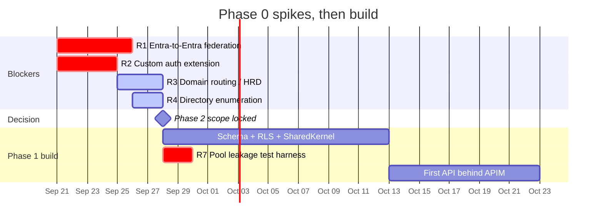

# 7. Risk Register — Ordered by Spike Priority

Ordered by **cost of being wrong × likelihood of being wrong**, not by severity alone. The
top four are Phase 0 and block Phase 2 design decisions. Everything below R4 can be
validated in parallel with Phase 1 build.

A note on confidence: several of these concern behaviour of Entra External ID external
tenants that is documented but, per the brief's own experience, does not always match
reality. **Treat documentation as a hypothesis and the spike as the test.** Where this
document states product behaviour without a spike reference, it is an assumption.

---

## Phase 0 — Spike before committing to the build

### R1 · Entra-to-Entra federation may not work as documented ⛔ BLOCKER

| | |
| --- | --- |
| **Risk** | A customer running their own Entra workforce tenant cannot be federated into our External ID tenant. Real-world reports indicate SAML federation from an External ID CIAM tenant to a partner Entra ID tenant failing despite documentation, and OIDC federation between Microsoft tenants being blocked in some configurations. |
| **Likelihood** | **High.** Direct federation has long-standing restrictions around domains already verified in another Entra tenant, and Microsoft-to-Microsoft OIDC has known blocks. |
| **Impact** | **Severe, and commercial rather than technical.** Large pharma and medical device organisations are disproportionately on Entra — plausibly the *majority* of our 20–30. If this path is blocked and we discovered it after signing, we have committed to an integration we cannot deliver. |
| **Spike** | Stand up a throwaway External ID tenant and a throwaway Entra workforce tenant. Attempt, in order: (1) SAML federation with a verified custom domain on the workforce side; (2) SAML with an unverified domain; (3) OIDC federation; (4) the `trusted-issuer` fallback end to end. Record exact error text and configuration for each. |
| **Exit criteria** | A decision table: for each customer archetype (own Entra + verified domain / own Entra + unverified / non-Entra SAML / non-Entra OIDC), which mode we support and with what caveats. |
| **Mitigation if blocked** | [ADR-0004](adr/0004-multi-issuer-fallback.md) — treat the customer's tenant as an additional trusted issuer. Already scaffolded. It works, costs less in MAU, and is arguably *better* for security-conscious customers because their own CA and device compliance apply natively. |
| **Effort** | 3–5 days |
| **Blocks** | Phase 2 scope; §5.6 sales conversations; any federation date commitment |

> **Do this first, and do not let a sales commitment precede its outcome.** This is the
> single highest-leverage unknown in the entire design.

---

### R2 · Custom authentication extension viability ⛔ BLOCKER

| | |
| --- | --- |
| **Risk** | `OnTokenIssuanceStart` may not be available, may not fire on all issuance paths (notably refresh-token-driven issuance), may have a latency budget we cannot meet, or may fail in a way that breaks all authentication. |
| **Likelihood** | Medium. The capability exists; the uncertainty is in the details — timeout envelope, refresh behaviour, payload limits, GA status for our configuration. |
| **Impact** | **Severe and architectural.** [§3.4 of the overview](00-overview.md) makes this the mechanism for the org claim. If it does not work, the org binding must come from directory extension attributes, which changes the suspension propagation model. It is also a self-inflicted SPOF on the auth path. |
| **Spike** | Deploy a trivial handler. Measure p50/p99/p999 latency. Confirm: does it fire on refresh? What is the hard timeout? What happens on 500, on timeout, on malformed response? Test claim size limits. Test it under the load of 30 customers' peak concurrent sign-in. |
| **Exit criteria** | Documented latency budget, confirmed failure behaviour, and a go/no-go on the DB-sourced claim model. |
| **Mitigation if blocked** | Degraded mode in [§2.6](02-auth-flows.md#26-flow-f--claims-enrichment-internals): org binding from `extension_…_cubeOrgId` directory attribute, synced by the reconciler. Loses instant fail-closed on suspension; the APIM deny-list still provides fast revocation, so this is acceptable. |
| **Effort** | 3–4 days |
| **Blocks** | Claim schema; the availability design of the identity service |

---

### R3 · Email-domain routing behaviour 🔶 HIGH

| | |
| --- | --- |
| **Risk** | `domain_hint` may not reliably pin exactly one IdP and suppress the identity-provider picker in an external tenant. If a user can see and click *any* configured IdP, that is a cross-organisation routing surface in a shared tenant. |
| **Likelihood** | Medium-high. Home-realm-discovery behaviour differs materially between workforce tenants, B2C and External ID external tenants. |
| **Impact** | **High — this is an isolation risk, not just UX.** See [§1.5](01-tenant-isolation-model.md#15-federated-idp-partitioning). |
| **Spike** | Configure two IdPs for two fake orgs in a test tenant. Attempt to reach org B's IdP while starting a sign-in for org A. Test `domain_hint`, `login_hint`, and any IdP-specific parameter. Test with and without an existing session. |
| **Exit criteria** | Evidence that either (a) one IdP can be pinned and others are unreachable, or (b) it cannot, and mitigation 2 from §1.5.2 is the sole control. |
| **Mitigation** | Already designed in: we own the HRD layer, and **org is resolved from the pre-existing user record, never from the IdP**. Even if the picker is reachable, an unexpected IdP yields a token with no `cube_org_id`. The spike determines whether that is our only defence or our second one. |
| **Effort** | 2–3 days |

---

### R4 · Directory enumeration by end users 🔶 HIGH

| | |
| --- | --- |
| **Risk** | A user of customer A can enumerate users of customer B via Graph or the sign-in experience. |
| **Likelihood** | Low-medium. External tenants restrict directory read for end users far more than workforce tenants do — but this must be **verified by test, not assumed from documentation**. |
| **Impact** | **High.** A demonstrated cross-customer enumeration is a reportable incident and a failed security review, even if no tender data leaks. Customer lists in Life Sciences are commercially sensitive on their own. |
| **Spike** | Obtain a user token in a test tenant. Attempt `GET /users`, `GET /users/{other-oid}`, `GET /me/memberOf`, group enumeration, and `/directoryObjects`. Attempt sign-in-page email probing for an existence oracle. |
| **Exit criteria** | Documented, tested confirmation that user-delegated tokens cannot read other users. A permanent regression test in CI against the non-prod tenant. |
| **Mitigation** | Scope our app registrations so no user-delegated Graph permission is ever requested. Verify tenant default user permissions. Ensure `/auth/discover` and password reset give no existence oracle ([§2.2](02-auth-flows.md#22-flow-d--email-domain-routing-the-entry-point-for-both-b-and-c)). |
| **Effort** | 1–2 days |

---

## Phase 1 — Validate alongside core build

### R5 · Administrative Unit support in external tenants 🔷 MEDIUM

| | |
| --- | --- |
| **Risk** | AUs, the documented mechanism for scoping directory admin to a user subset, may be unavailable or partial in external tenants. |
| **Impact** | **Low as designed** — this is why [§1.4.2](01-tenant-isolation-model.md#142-why-not-administrative-units) removes the dependency entirely by giving customers no directory access at all. It matters only if a future requirement forces customer directory access. |
| **Action** | Confirm during Phase 1. Record the answer. Do not design around it. |
| **Effort** | 0.5 day |

### R6 · Multi-issuer validation through APIM 🔷 MEDIUM

| | |
| --- | --- |
| **Risk** | The `choose` + `validate-jwt` pattern in [§4.3](04-apim-configuration.md#43-multi-issuer-validation-at-the-gateway) may not perform acceptably, may not cache JWKS per issuer correctly, or may not support a dynamic issuer list without a policy redeploy per customer. |
| **Impact** | Medium. A policy redeploy per new trusted-issuer customer is tolerable at 30 but is exactly the manual scaling problem we are avoiding. |
| **Action** | Prototype with three issuers. Measure added latency. Confirm JWKS caching is per-issuer and that a customer key rotation does not disturb others. Determine whether the issuer list can come from a named value refreshed by the reconciler. |
| **Effort** | 2 days |

### R7 · Connection-pool org-context leakage 🔶 HIGH (ours to cause)

| | |
| --- | --- |
| **Risk** | `set_config('app.current_org_id', …, false)` is session-scoped and connections are pooled. A connection returned without clearing the setting can serve the next request under the previous request's org. |
| **Likelihood** | Medium — it is an easy mistake and it does not show up in single-threaded testing. |
| **Impact** | **Critical. This is the highest-severity bug available in this design** — it would produce silent cross-tenant reads that pass every other layer, because RLS would be correctly enforcing the *wrong* org. |
| **Action** | Clear on `ConnectionDisposing`. Dedicated concurrency test: 2-connection pool, two orgs, high concurrency, assert zero cross-reads over thousands of iterations. Consider `SET LOCAL` inside an explicit transaction as a stronger alternative. Run it in CI on every build, not nightly. |
| **Effort** | 2 days including the test harness |

### R8 · Claims-enrichment endpoint availability 🔷 MEDIUM

| | |
| --- | --- |
| **Risk** | The endpoint is on the critical auth path for every customer. Its outage is a platform-wide authentication outage. |
| **Impact** | High if it happens; the design in [§2.6](02-auth-flows.md#26-flow-f--claims-enrichment-internals) is what keeps likelihood low. |
| **Action** | Zone-redundant hosting, separate deployment unit, read-replica or cached lookups, synthetic canary per org archetype at 5-minute intervals, documented degraded mode. |
| **Effort** | Ongoing through Phase 1 |

---

## Phase 2+ — Monitor and manage

### R9 · MAU cost growth 🔷 MEDIUM

Covered in detail in [08-mau-cost-model.md](08-mau-cost-model.md). Summary: MAU can grow
far faster than customer count if service identities, support accounts or test users end
up as directory users. Instrument per-org MAU from our own token telemetry so the number
is known before the Azure bill arrives.

### R10 · Tenant-wide configuration blast radius 🔶 HIGH (process, not technical)

The realistic single-tenant incident is an operator changing a tenant-wide setting and
affecting 30 customers simultaneously. Mitigated entirely by process: no manual production
portal changes, all configuration through the reviewed reconciler pipeline, drift detection
alerting on out-of-band change. **The control is only as good as the discipline** — if
engineers retain standing portal write access, the mitigation is fiction. Remove standing
access; PIM only.

### R11 · Single tenant-wide password and MFA policy 🔵 LOW-MEDIUM

One tenant means one policy. The most security-conscious customer effectively sets it for
everyone. Not technically fixable within the fixed tenant topology. Manage contractually:
set it strict from day one, and surface it in the sales security conversation rather than
in a customer's security review.

### R12 · Token size growth 🔵 LOW

Enriched claims plus federated IdP claims can push tokens toward header size limits. Kept
low by the decision to keep roles out of tokens. Monitor p99 token size; alert at 6 KB.

### R13 · Entra service limits on identity providers 🔵 LOW

Confirm the per-tenant `identityProviders` limit during R1. At 30 customers we are very
likely fine; it constrains growth past a few hundred, where `trusted-issuer` mode has no
equivalent limit.

---

## Summary — recommended sequence

**The two crit-path items are R1 and R2, and they are independent — run them in parallel
from day one.** Everything downstream of them is either blocked or is building something
that may need to change. Nothing else in this plan is worth starting before those two have
answers.

---

## Runnable spike plans

The Phase 0 spikes are implemented as executable scripts in [`spikes/`](../../spikes),
not just described here:

| Spike | Entry point |
| --- | --- |
| R1 federation matrix | `python -m spikes.r1_entra_federation.run_matrix` |
| R1 trusted-issuer fallback | `python -m spikes.r1_entra_federation.test_trusted_issuer` |
| R2 instrumented endpoint | `python -m spikes.r2_token_issuance.endpoint` |
| R2 analysis | `python -m spikes.r2_token_issuance.analyze` |
| R3 IdP reachability | `node spikes/r3_domain_routing/probe_idp_reachability.mjs` |
| R4 enumeration probes | `python -m spikes.r4_directory_enumeration.run_probes` |

Every run captures evidence — full request/response transcripts including Graph
`request-id` values — and every script refuses to touch a tenant not explicitly marked
disposable. Outcomes land in [`spikes/RESULTS.md`](../../spikes/RESULTS.md), which is the
decision table that Phase 2 scope and the §5.6 sales gate both read from.
